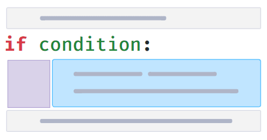
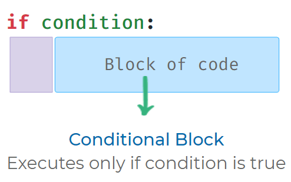
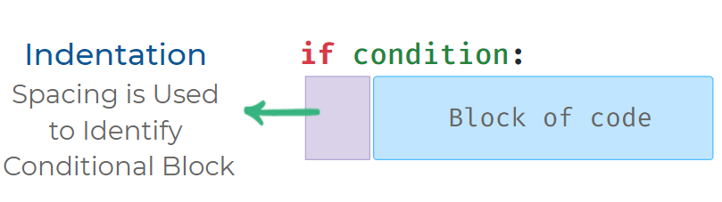
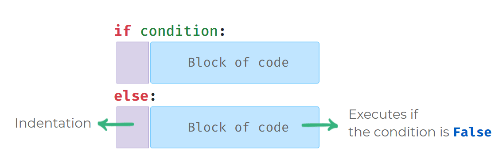

# 🧠 Conditional Statements | Cheat Sheet

## **Block of Code**

A sequence of instructions is called a **block of code**.
Python executes code **in sequence**.

---

## **Condition**

A **condition** is an expression that results in either **True** or **False**.

### Examples:

- `2 < 3`
- `a == b`
- `True`

---

## **Conditional Statement**

A conditional statement allows you to **execute a block of code only when a condition is True**.



---

## **Conditional Block**

The block of code that executes **only if a condition is True** is called the **conditional block**.



---

## **Indentation**

Indentation = space(s) in front of the conditional block.
It is used to **identify the conditional block**.

✔ Standard practice: **4 spaces** for indentation.



---

## **Possible Mistakes**

All statements inside a conditional block must have the **same indentation**.

### ❌ Wrong Code

```python
if True:
    print("If Block")
            print("Inside If")
```

**Output:**

```
IndentationError: unexpected indent
```

### ✅ Correct Code

```python
if True:
    print("If Block")
    print("Inside If")
```

---

## **If–Else Syntax**

The `else` block executes **only when the if condition is False**.



---

## **Using If–Else**

```python
a = int(input())
if a > 0:
    print("Positive")
else:
    print("Not Positive")
print("End")
```

**Input:**

```
2
```

**Output:**

```
Positive
End
```

---

## **Possible Mistakes in If–Else**

`else` must be used **along with an if**.
It must be written **immediately after** the if-block.

### ❌ Wrong Code

```python
if False:
    print("If Block")
print("After If")
else:
    print("Else Block")
print("After Else")
```

**Output:**

```
SyntaxError: invalid syntax
```

### ⚠️ Warning

No code is allowed **between** the `if` block and the `else` statement.

---
